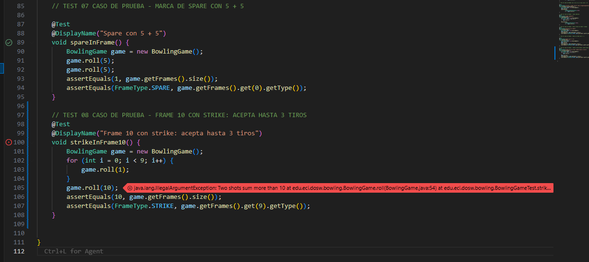
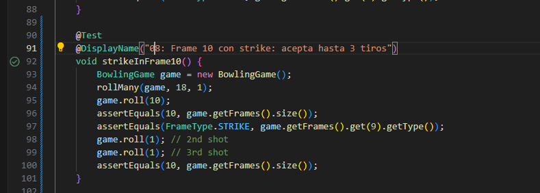
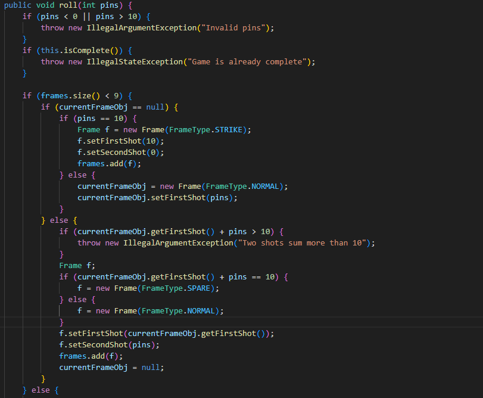
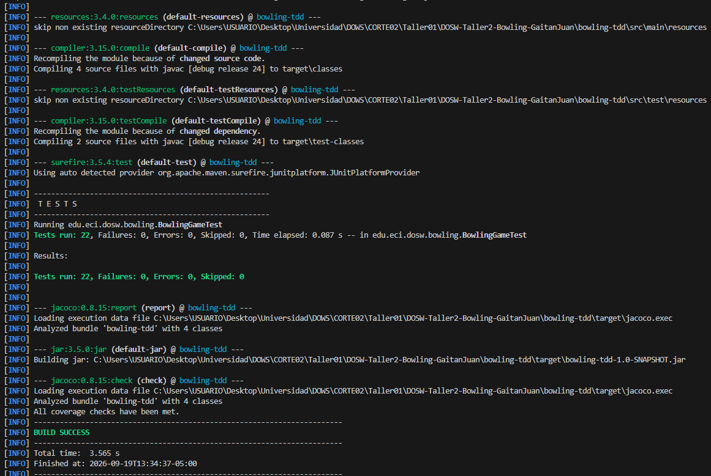
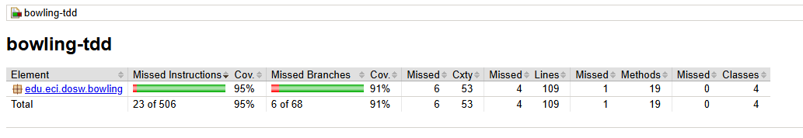
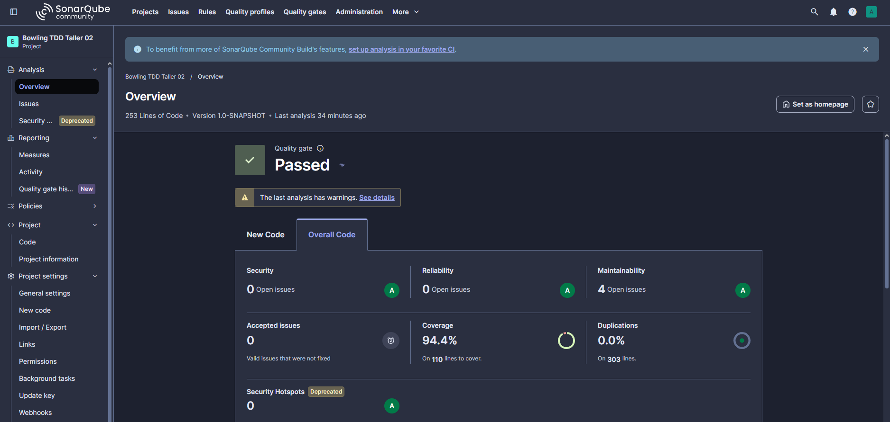
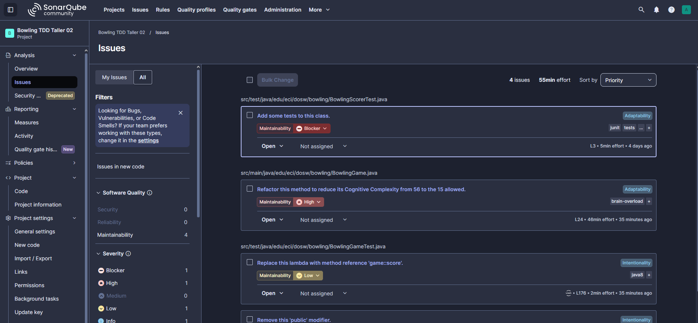
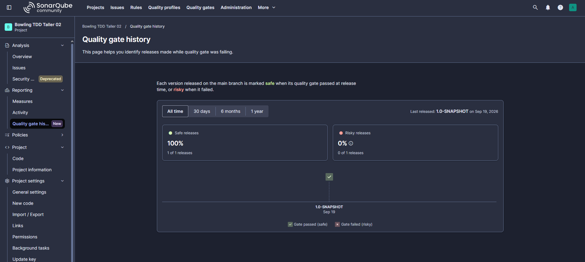

# TALLER BOWLING TDD

## JUAN DIEGO GAITAN PEREZ
## 1000105535
## INGENIERIA DE SISTEMAS 
## DOWS 2026-02
## JUAN.GAITAN-P@MAIL.ESCUELAING.EDU.CO

## Descripcion
BowlTech es una aplicacion que implementa la logica de puntuacion del juego de bolos (Bowling) tradicional.
Implementa las siguientes reglas principales:
- Una partida consta de 10 turnos (frames).
- En cada turno, el jugador tiene hasta 2 oportunidades (rolls) para derribar los 10 bolos.
- **Spare:** Si derriba los 10 bolos en 2 tiros, obtiene 10 puntos mas el numero de bolos derribados en el siguiente tiro.
- **Strike:** Si derriba los 10 bolos en el primer tiro del turno, obtiene 10 puntos mas el total de bolos derribados en los siguientes 2 tiros.
- **Turno 10:** Si se lanza un strike o spare en el decimo turno, el jugador puede realizar hasta 3 lanzamientos en ese turno.

**Responsabilidades de cada clase:**
- `BowlingGame`: Es la clase principal encargada de llevar el registro de los lanzamientos (`roll`) y calcular la puntuacion total (`score`) de la partida en cualquier momento. Aplica las reglas de los bolos para calcular los bonos de strikes y spares.
- `BowlingGameTest`: Contiene las pruebas unitarias que verifican el correcto funcionamiento de `BowlingGame` siguiendo la metodologia TDD.

## EVIDENCIA TDD

### ROJO (Prueba Fallida)

### VERDE (Prueba Exitosa)

### REFACTORIZACION (Mejora del Codigo)

## JACOCO EVIDENCIA

## SONARQUBE

### COBERTURA
El analisis estatico demostro que la cobertura del codigo cumple con los estandares definidos en el Quality Gate.

### ISSUES
Se resolvieron los diferentes Code Smells e Issues de mantenibilidad reportados por la herramienta para mejorar la calidad del software.

### QUALITY GATE
El Quality Gate paso exitosamente, garantizando que el proyecto esta listo bajo estandares de calidad limpios y mantenibles.

## PREGUNTAS

**01. Que caso edge del Bowling fue el mas dificil de implementar con TDD y por que?**
El caso mas complejo fue el decimo turno (Frame 10), especificamente cuando ocurre un Strike o Spare. Esto se debe a que rompe el patron habitual de "avanzar al siguiente turno despues de un Strike" o "tener solo 2 lanzamientos por turno", permitiendo un tercer lanzamiento que solo sirve como bono y no inicia un nuevo turno.

**02. Que parte del codigo cambio durante REFACTOR sin modificar el comportamiento observable?**
Se extrajo la logica condicional repetitiva que identificaba si un tiro era un Strike o un Spare hacia metodos auxiliares (ej. `isStrike(frameIndex)` y `isSpare(frameIndex)`). Tambien se separo el calculo de los bonos en metodos propios (`strikeBonus` y `spareBonus`), haciendo que el metodo principal `score()` fuera mucho mas limpio y declarativo sin afectar las pruebas.

**03. Que casos de prueba descubriste al revisar el reporte de cobertura de JaCoCo que no habian considerado antes?**
El reporte de JaCoCo evidencio que, aunque teniamos cobertura de juegos perfectos y juegos de cero puntos, no estabamos cubriendo adecuadamente ramas relacionadas a validaciones de entradas (por ejemplo, prevencion de ingresar numeros negativos de bolos o totales mayores a 10 en un turno no final), lo que impulso a agregar mas casos de prueba defensivos.

**04. Que hallazgo de SonarQube produjo un cambio real en el codigo?**
SonarQube marco como "Code Smell" el uso de "Magic Numbers", en este caso el numero `10` repetido a lo largo de la clase (para indicar los puntos de un Strike/Spare, el numero maximo de bolos y la cantidad de turnos). Esto produjo un cambio real al introducir constantes descriptivas, mejorando enormemente la mantenibilidad y comprension del codigo.
